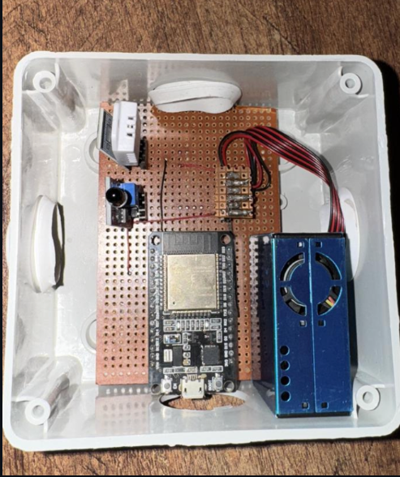

# IoT Air Quality Monitoring System

**Authors:**  Iqra Jawad Ahmad (CS-22034)  
**Department:** Computer Systems Engineering  
**Hardware:** ESP32 Microcontroller, DHT11, MQ-135  
**IoT Platforms:** Blynk, ThingESP, Google Sheets, OTADrive  

---

## Project Overview
This project implements a **real-time Air Quality Monitoring System** using the ESP32 microcontroller integrated with temperature, humidity, and gas sensors. The system:  
- Sends real-time data to **Blynk app** and **Google Sheets**  
- Supports **WhatsApp-based queries** via ThingESP  
- Allows **OTA firmware updates** via OTADrive  
- Provides **alerts** for high temperature or dangerous gas levels  

**Objective:** Provide a low-cost, scalable solution for monitoring indoor/outdoor air quality and promoting environmental awareness.  

---

## System Architecture
  
*(Replace with your system image)*

Key components:  
- **ESP32 Microcontroller:** Reads sensors, processes data, sends to cloud  
- **DHT11:** Temperature & humidity  
- **MQ-135:** Gas concentration  
- **WiFi & Cloud Services:** Blynk, Google Sheets, ThingESP, OTADrive  

---

## Full Project Report
You can view the complete project report here:  
[Air Quality Monitoring System Report (PDF)](Air_Quality_Monitoring_System.pdf)
